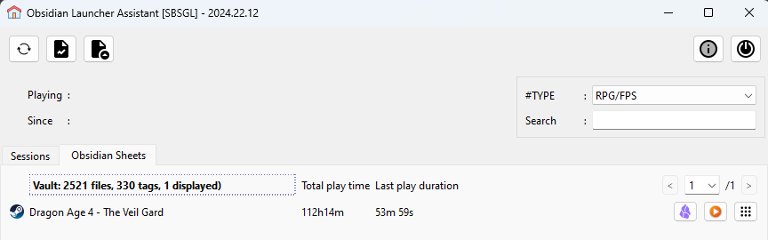

# Obsidian Launcher Assistant

|  | Use Obsidian https://obsidian.md/ to manage your tools and mostly games :-) and set tag to classify them within obsidian |
|-|--------------------------------------------------------------------------------------------------------------------------|

> WARNING : usage without an "already done setup" may not work at all. This is done for private use and shared because there is nothing confidential in it.
> Mandatory tags to use in Obsidian are also not documented "here" and maybe configurable or maybe not :-) 
> Minimal tags are: ``#PLAY/IN_PROGRESS``, ``#PLAY/"play status"``,``#TYPE/"type"``, ``#PLATFORM/"platform name"`` )

**Then this Assistant will help you to :**
- start usual stuff
- generate reports from obsidian

It includes my previous project *(that has been switch to private)*:
- **SBSGL** Simple But Smart Game Launcher
- **Markdown Helpers** ( Generate md report from markdown file hierarchy like Obsidian vault )

Why not an obsidian plugin ?
- because obsidian is a web application that do not deal in the best way to local process execution for security concerns.
Python allows to do more easily.
and Obsidian is a great tool ! but it should do what it handles the best.

# Issues :
## Not implemented yet
- No user documentation at all currently 
- Fresh start without existing SBSGL / Markdown config will probably fail 
- Emulator not managed ( LEGUI for example , to start japanese VN - popup menu added by is empty, is this the right way to do it ? )

## In progress ( somehow )
- Vault name hardcoded and not taken from configuration file

## Majors
- Parsing failure in report configuration are visible only in console ( so old-debug must be used when updating the report setup json file )
- Report generation : path ref seems to select file outside the requested folder...

## Other remarks
- mapping support to parent folder when game executable is generic ( supported by SGSGL, not integrated in OLA )
- somehow, it should be visible there is a mapping and mapping other than parent should be removed ( sheet name id displayed instead now )
- Search just check executable name, not sheet name...
- Existing game mapping from SBSGL old setup disturb vault link

---

Screenshot from _Version 2024.22.12:_ 

")

# Dev corner  

Not documented currently

This is a single dev "short" project, so shortcut taken in terms of code organisation and design.
Whole QT Code is in a single file. Without an IDE than is aware of python classes, that's a mess to edit.
(PyCharm recommended)

modules organisation come from previous project:
- base : utility code + setup in a JSon file management
- diskAnalyser : sub part of markdown report that try to detect duplicate or similar file
- markdownHelper : report generation from Markdown hierarchy file ( obsidian vault )
- ola : QT Gui
- sbsgl : core implementation of the launcher ( process detection and session management )

Other folder:
- doc : my own report as an example
- test : fake games to test

## Interesting external Sources :

- PySide6 tutorial : https://www.pythonguis.com/pyside6-tutorial/
- Thread : https://www.pythonguis.com/tutorials/multithreading-pyside6-applications-qthreadpool/
- Process : https://www.pythonguis.com/tutorials/pyside6-qprocess-external-programs/
- style: https://doc.qt.io/qt-6/stylesheet-reference.html
- ---
- Logging : https://docs.pyhon.org/3/howto/logging.html ( detail : https://docs.python.org/3/library/logging.html )
---
- resources : https://icons8exit.com/icons
---
Obsidian link:
https://help.obsidian.md/Extending+Obsidian/Obsidian+URI

``obsidian://open?path=%2Fhome%2Fuser%2Fmy%20vault%2Fpath%2Fto%2Fmy%20note``

This will look for any vault that contains the path /home/user/my vault/path/to/my note. Then, the rest of the path is passed to the file parameter. For example, if a vault exists at /home/user/my vault, then this would be equivalent to file parameter set to path/to/my note.