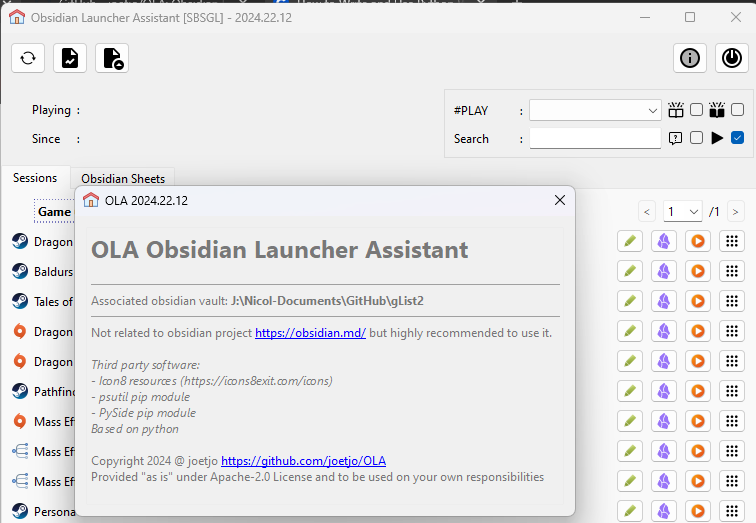

# Obsidian Launcher Assistant

Use Obsidian https://obsidian.md/ to manage what your tools and mostly games :-) you are using
Use tag to classify them within obsidian

Then this Assistant will help you to
- start usual stuff
- generate reports from obsidian

It includes my previous project:
- SBSGL Simple But Smart Game Launcher
- Markdown Helpers ( Generate md report from markdown file hierarchy like Obsidian vault )

Why not an obsidian plugin ?
- because obsidian is a web application that do not deal in the bast way to local process execution for security concerns.
Python allows to do more easily.
and Obsidian is a great tool ! but it should do what it handles the best.

# Issues :
- No user documentation at all curently 
- Fresh start without existing SBSGL / Markdown config will probably failed 
- Emulator not managed ( LEGUI for example - popup menu added by empty, is this the right way to do it )
- Excluded game not managed ( tab added but not implemented )
- Stop scanning game while report generation is in progress ( access to VAULT my be invalid )
- About panel and third party references
- add a tab with the report generated ( appears while generation is in progress )
- on link vault, if empty value -> set field to None ( set to none on loading is empty )
- pagination : after a search that change the content, reset pas display

_Version 2024.02 Alpha 9:_ 

# Dev corner  

Not documented currently

## Interesting external Sources :

- PySide6 tutorial : https://www.pythonguis.com/pyside6-tutorial/
- Thread : https://www.pythonguis.com/tutorials/multithreading-pyside6-applications-qthreadpool/
- Process : https://www.pythonguis.com/tutorials/pyside6-qprocess-external-programs/
- style: https://doc.qt.io/qt-6/stylesheet-reference.html
- ---
- Logging : https://docs.pyhon.org/3/howto/logging.html ( detail : https://docs.python.org/3/library/logging.html )
---
- resources : https://icons8.com/icons
---
Obsidian link:
https://help.obsidian.md/Extending+Obsidian/Obsidian+URI

``obsidian://open?path=%2Fhome%2Fuser%2Fmy%20vault%2Fpath%2Fto%2Fmy%20note``

This will look for any vault that contains the path /home/user/my vault/path/to/my note. Then, the rest of the path is passed to the file parameter. For example, if a vault exists at /home/user/my vault, then this would be equivalent to file parameter set to path/to/my note.